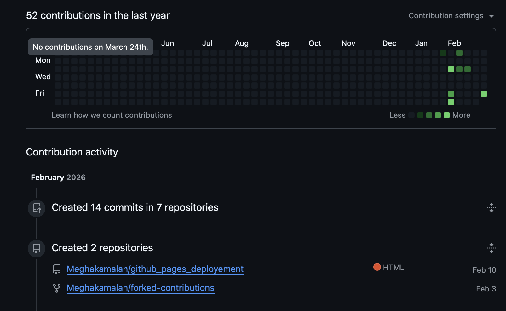

# Workshops In Web Developmemnt1

 This workshop focused on real-world development tools used in the industry. I learned how to use Git and GitHub for version control and collaboration

## Repository Link
https://github.com/Meghakamalan/http_5114_workshops_in_web_dev1
 
## image:



## What I Learned :
* Creating and cloning repositories
* Using git add, commit, push
* Writing professional README files
* Managing projects using branches
* Hosting projects using GitHub Pages

##  Sample:

Below is a simple example of commands used in terminal:

```GitHub
git init
git add .
git commit -m "Initial commit"
git push origin main
